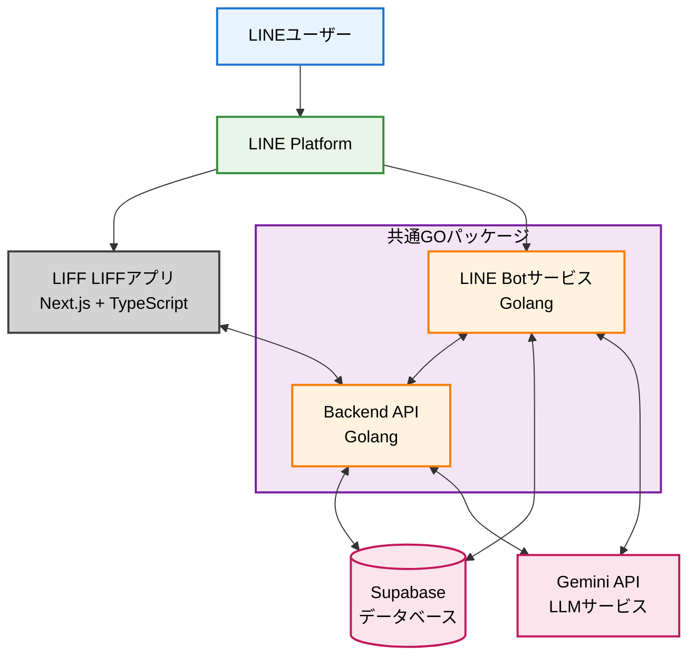

# LINE Bot + LIFFの統合アプリのテンプレートコード - AI時代にこそ必要なFull Stack Template

## はじめに

「AIがコードを書いてくれる時代に、なぜFull Stack Templateが重要なのか？」

この問いに対する私の考えは **どんなに美しい葉っぱ(AIが生成した個別機能)も、しっかりとした幹(整理されたアーキテクチャ)がなければ、健全な木(プロダクト)にはならない**からです。

### 実例：CookForYou

私が開発している[**CookForYou**](https://cook-for-you.com)は、LINE BotとLIFF Webアプリで使った料理をとおして、幸せををコンセプトに作られたアプリです。

一度以下のボタンまたはQRコードから友達追加していただき、Lineを通したアプリを体験してみてください。
TODO: QRコードを追加
TODO: ボタンの追加

## 公開に至った経緯

「また認証フローをゼロから書くのか…」「フロントとバックの連携が面倒だ…」

LINEアプリ開発がビジネスの中心になる今、多くの開発者がこうした本質的でない作業に時間を奪われています。私自身もその一人でした。

この経験から「創造的な作業に集中できる土台さえあれば、開発者はもっと素晴らしいアプリを生み出せる」と確信し、**コア機能だけを研ぎ澄ませたFull Stack Templateリポジトリ**を作成し、公開することとしました。

**このテンプレートを使えば、CookForYouのような統合LINEアプリを短期間で構築できます。**

## 🌟 Full Stackテンプレートで何ができるのか？

このテンプレートは、**フロントエンドからバックエンド、データベース、LLM統合まで**を含みます。クローンした瞬間から、本格的なLINEアプリケーションの開発を始められます：

### スタック一覧

**Backend Layer (Golang)**
- 🔐 認証API（LINE OAuth → Supabase Auth連携）
- 💬 会話API（Gemini LLM統合）
- 📝 共通パッケージ（LLMクライアント、リポジトリ層）

**Frontend Layer (Next.js + TypeScript)**
- 🌐 LIFF Webアプリ（チャットUI）
- 🎨 モダンなUI（Tailwind CSS + shadcn/ui）
- 🔄 リアルタイム同期（Supabase Realtimeを導入することで）

**Database Layer (Supabase)**
- 🗄️ PostgreSQL（マイグレーション完備）
- 🔒 Row Level Security（RLS）
- 👤 認証システム（Supabase Auth）

**LINE Integration Layer**
- 🤖 LINE Bot Service（Webhook処理）
- 📱 LIFF統合（LINE Front-end Framework）
- ✅ 署名検証（セキュリティ）

**Infrastructure Layer**
- 🐳 Docker対応（Backend、LINE Bot）
- 📝 デプロイ準備完了（.env.example、Dockerfile完備）
- 🔧 インフラ非依存設計（任意のクラウドに対応可能）

### 実現できる機能
本テンプレートレポジトリでは以下の機能が実装されています。

- 🤖 **LINE Botとの会話**: Gemini LLMを使った自然言語対話
- 🌐 **LIFF Webアプリ**: ブラウザで使えるチャットUI
- 🔄 **Botの会話がLIFFでも表示される**: LINE BotとLIFFの接続として、Botの会話履歴がLIFFでも表示される
- 🔐 **エンタープライズグレード認証**: 本番環境で実績のある認証フロー
- 🚀 **スケーラブルなインフラ**: サーバーレス構成でコスト最適化


## 🎯 なぜFull Stack Templateが必要なのか？

### 1. AIは「MVP」は作れるが「複雑なシステム」は設計できない

最近、Cursor、GitHub Copilot、Claude等のAIアシスタントの登場により「それっぽく動くプロトタイプ」を作る難易度はかなり下がりました。

**しかし、AIに「LINEアプリを作って」と頼んでも、こんな問題に直面します：**

❌ フロントエンドとバックエンドの接続が曖昧  
❌ 認証フローが不完全（セキュリティホールだらけ）  
❌ データベーススキーマが非効率  
❌ 各サービス間の通信が不安定  
❌ **最大の問題**: ルールのないコード追加が、瞬く間にスパゲッティコード化に

**なぜスパゲッティになるのか？**

AIは「開発者のリクエスト」に対して最適なコードを書きますが、**プロジェクト全体の構造やルール**をきちんと設定してないと以下のようなエラーに当たるのはあるあるだと思います。

```
┌─ 1回目: ユーザー認証機能 → auth.tsを作成
├─ 2回目: プロフィール取得 → user.tsを作成（authと重複）
├─ 3回目: 認証エラー処理 → error.tsを作成（またauth関連）
├─ 4回目: トークンリフレッシュ → token.tsを作成（さらに分散）
└─ 結果: 認証ロジックが4ファイルに散乱、どれがソースオブトゥルース？
```

**Full Stack Templateがあれば：**

✅ **規則的なフォルダ構造**が既にある（どこに何を書くべきか明確）  
✅ **本番環境で実績のある認証フロー**（セキュリティホールなし）  
✅ **最適化されたスキーマとインデックス**（パフォーマンス問題なし）  
✅ **サービス間通信の完全な実装**（API仕様が統一）  
✅ **一定のルールに縛られた状態で開発**できるから、コードが綺麗に保たれる

これが冒頭の**「幹」の話**です：

🌳 **しっかりした幹（テンプレート）** = 規則的な構造、明確なアーキテクチャ  
🍃 **美しい葉っぱ（AIの機能追加）** = 個別機能の実装

**幹なしで葉っぱだけ増やしても、健全な木にはなりません。**

特に簡単は機能のアプリはすぐに作れるようになった時代だからこそ、しっかりした幹を持ってアプリを開発することで多機能で多角的にvisionを達成できるような、他と差別化ができるアプリを作ることができるようになります。

### 2. 使い回せるセキュリティ実装

特に認証周りは、毎回ゼロから実装するべきではありません。このテンプレートには、私が以前Qiitaで公開した[LINE + Supabase + Next.js認証フロー](https://qiita.com/yongyong/items/8bf9e2a9da23dc2f148f)が組み込まれています。

**認証フロー（簡略版）**:
```
LIFF App → LINE Access Token取得
        → Backend APIでトークン検証
        → Supabase Authでユーザー作成/取得
        → JWT発行 → 以降のAPI呼び出しで使用
```

この実装は本番環境で実績があり、そのままテンプレートに含まれています。

### 3. なぜPythonではなくGolangなのか？

多くのLLM統合プロジェクトはPythonで書かれていますが、私があえてGolangを選んだ理由は2つ：

#### ① 型安全性による堅牢性

```go
// Golangでの例
type Conversation struct {
    ID      string    `json:"id"`
    UserID  string    `json:"user_id"`
    Role    string    `json:"role"`
    Content string    `json:"content"`
}

// コンパイル時に型チェック
func ProcessMessage(conv *Conversation) error {
    // ここで型の不整合があればコンパイルエラー
}
```

AIが生成したコードでも、型システムが守ってくれます。

#### ② Cold Start問題の解決 = UXとコストの両立

サーバーレス環境で**最小インスタンス数を0**にすると、使用していない時は完全無料になります。しかし、Pythonでこれをやると：

**Pythonの場合（Cold Start: 5-7秒）:**
```
ユーザー「こんにちは」
　→ 5秒待機（Cold Start）
　→ Loading iconが出る
```

**これだと、UXが壊滅的に悪いため、常時起動（min instance = 1以上）が必須 → コスト増**

**一方Golangの場合（Cold Start: 100-300ms）:**
```
ユーザー「こんにちは」
　→ 0.1秒待機（ほぼ気づかない）
　→ Loading iconが出る
```

**UXを損なわずmin instance = 0が可能 → 使用時のみ課金で大幅節約**

| 言語 | Cold Start | Min Instance | 月額コスト(小規模) | UX |
|------|-----------|--------------|-------------------|-----|
| Python | 5-7秒 | 1以上必須 | $50-100 | ❌ 初回が遅い |
| Golang | 100-300ms | 0でOK | $0-5 | ✅ 快適 |

**Golangなら、サーバーレスの真の利点（完全従量課金）を享受しながら、優れたUXを提供できます。**

※同様のモチベーションで **サーバーレスでレコメンデーションシステム** を作ることで、UXの工場とコストを削減を達成した事例は[Serverless MLレコメンデーション：LLMを活用した自身でモデルを持たない、レコメンデーションの実装](https://qiita.com/yongyong/items/71a9dd65a649f2a225b8)を御覧ください。


# Template repoに付いて

このレポジトリコードは、lineBotで会話した内容がLIFFにも反映される、ミニマムアプリです。

TODO: APPが動作しているところの動画か画像を入れる


## 🏗️ Full Stack構成

このテンプレートは、モダンなマイクロサービスアーキテクチャで構成されています：

### 技術スタック全体像



**構成のポイント:**
- 🔧 **Go Workspace**: LINE BotとBackend APIが`common/`パッケージを共有
- 🌐 **フロー**: LIFF → Next.js → Backend API (REST)
- 🤖 **LLM**: 両サービスが直接Gemini APIにアクセス
- 🗄️ **DB**: 両サービスがSupabaseに接続

### 各レイヤーの詳細

**Frontend (LIFF App)**
- **言語**: TypeScript
- **フレームワーク**: Next.js 15 (App Router)
- **UI**: Tailwind CSS + shadcn/ui
- **認証**: @line/liff + @supabase/ssr
- **デプロイ**: 任意 (Vercel, Cloudflare Workers, etc.)

**Backend API**
- **言語**: Go 1.24.2
- **フレームワーク**: Gin（軽量で高速）
- **認証**: Supabase JWT検証
- **デプロイ**: Google Cloud Run

**LINE Bot Service**
- **言語**: Go 1.24.2
- **フレームワーク**: Gin
- **SDK**: line-bot-sdk-go v8
- **接続先**: LINE Messaging API (Webhook)
- **Webhook**: 署名検証ミドルウェア
- **デプロイ**: 任意（Docker対応）

**Shared Package (common/)**
- **LLM Client**: Google Gemini 2.5 Flash Lite統合
- **Repository**: Supabase CRUD操作
- **Models**: 共通データ構造
- **Mage**: ビルドタスク自動化

**Database (Supabase)**
- **PostgreSQL**: マイグレーション管理
- **Auth**: ユーザー認証
- **RLS**: Row Level Security
- **Realtime**: リアルタイム同期（オプション）

### なぜこの構成なのか？

✅ **モノレポ（Go Workspace）**: `common/`パッケージが両サービスに組み込まれ、コード重複を完全排除  
✅ **型安全**: Golang + TypeScriptで堅牢性確保  
✅ **マイクロサービス**: 各サービスが独立してスケール  
✅ **インフラ非依存**: Dockerコンテナで任意のクラウドに対応  
✅ **セキュリティファースト**: 署名検証、JWT認証、RLS  

**重要**: LINE BotとBackend APIは、同じ`common/`パッケージ（LLMクライアント、モデル、リポジトリ）を共有しています。これにより、ロジックの一貫性を保ちながらコードの重複を避けています。  

### ミニマルで拡張可能な設計哲学

このテンプレートは、**あえて機能モリモリにしていません**。理由は：

🎯 **コア機能に集中**  
認証、会話、同期という最小限の機能のみ実装。不要な機能がないため、理解しやすく、カスタマイズしやすい。

🔧 **拡張性を重視**  
堅牢なアーキテクチャの「幹」があれば、AIを使って機能を簡単に追加できる。画像認識、音声対応、リッチメニューなど、必要な機能を自由に拡張可能。

📦 **あえて含めていないもの**

このテンプレートには、意図的に以下を含めていません：

- **❌ デプロイ設定（CI/CD、クラウド固有設定）**  
  → プロジェクトごとに要件が異なるため。Dockerfileがあればどこでもデプロイ可能

- **❌ TEST (unit test, integration test, e2e test)**  
  → テスト戦略や使用するライブラリはプロジェクト要件に強く依存するため、テンプレートには含めていません。開発者が自身のプロジェクトに最適なテスト手法を自由に選択できるよう、あえて特定の構成を強制しない方針です。

- **❌ サービス間の密な連携（gRPC、メッセージキュー等）**  
  → シンプルなREST APIで十分な場合が多い。必要なら後から追加できる

- **❌ 過度な抽象化や複雑なデザインパターン**  
  → 学習コストを下げ、すぐに理解できる構造を優先

- **❌ フロントエンドの高度なUIライブラリ**  
  → shadcn/uiの基本コンポーネントのみ。プロジェクトに合わせてカスタマイズ

🧪 **学習に最適**  
シンプルな構成だからこそ、各レイヤーの役割と連携が明確。Full Stack開発の本質を学べる。

**「最小限で完結」かつ「無限に拡張可能」** - これがこのテンプレートの設計思想です。

必要なのは**堅牢な幹（アーキテクチャ）**と**明確なルール（フォルダ構造）**。あとはAIに機能を追加させればいい。

## 📂 プロジェクト構造

```
LineBot-liff-golang-nextjs-template/
├── common/              # 共通Golangパッケージ（Go Workspace）
│   ├── llm/            # Geminiクライアント
│   ├── models/         # データモデル
│   ├── repository/     # Supabaseアクセス層
│   └── mage/           # ビルドタスク
├── backend/            # Backend API
├── line_bot/           # LINE Bot Service
├── liff/               # LIFF App（Next.js）
└── supabase/           # DBマイグレーション
    └── migrations/

各サービスがDockerコンテナ化済み、任意のクラウド環境にデプロイ可能
```

## 🔐 セキュリティのポイント

### LINE Webhook署名検証
```go
func ValidateSignature(channelSecret string) gin.HandlerFunc {
    // すべてのWebhookで署名を検証
    // 不正なリクエストをブロック
}
```

### Supabase Row Level Security (RLS)
```sql
-- ユーザーは自分の会話のみ閲覧可能
CREATE POLICY "Users can view own conversations"
  ON conversation FOR SELECT
  USING (user_id = (SELECT line_id FROM "user" WHERE id = auth.uid()));
```

### JWT認証ミドルウェア
```go
func Auth() gin.HandlerFunc {
    // Supabase JWTを検証
    // すべてのAPIエンドポイントで認証を強制
}
```

## 🔄 会話同期の仕組み

LINE BotとLIFFでの会話が同期される理由は、**共通のデータモデルとLINE User IDの活用**です：

```sql
-- 会話テーブル（共通）
CREATE TABLE conversation (
  id UUID PRIMARY KEY,
  user_id TEXT NOT NULL,  -- LINE User ID
  role TEXT,              -- 'user' or 'assistant'
  content TEXT,
  created_at TIMESTAMPTZ
);
```

**同期の流れ:**
1. LINE Botでメッセージ受信 → LINE User IDで会話をSupabaseに保存
2. LIFFアプリを開く → Supabase認証でLINE User ID取得 → 同じIDで会話履歴を取得
3. **結果**: 完全に同期された状態で表示

## 🚀 使い方（クイックスタート）

```bash
# 1. クローン
git clone https://github.com/Yongtae723/LineBot-liff-golang-nextjs-template

# 2. Supabase起動
cd supabase && supabase start

# 3. 環境変数設定（.exampleをコピーして編集）
# backend/.env, line_bot/.env, liff/.env.local

# 4. サービス起動
cd backend && go run mage.go run      # Terminal 1
cd line_bot && go run mage.go run     # Terminal 2  
cd liff && npm run dev                # Terminal 3
```

**これだけで、Full Stack LINEアプリが動作します。**

## 🚢 本番環境デプロイ

Dockerfileが用意されているので、お好きな環境にデプロイできます：

**Backend & LINE Bot**: Cloud Run、ECS、Railway、Fly.io等  
**LIFF App**: Cloudflare Workers(OpenNext)、Vercel、Netlify等


## 🎓 このFull Stack Templateから学べること

### 1. 完全なマイクロサービスアーキテクチャ
- Go Workspaceでのモノレポ管理
- サービス間通信の実装パターン
- 共通パッケージの設計

### 2. プロダクショングレードの認証フロー
- LINE OAuth → Supabase Auth連携
- JWT検証とミドルウェア実装
- Row Level Securityによるデータ保護

### 3. LLM統合の実践的パターン
- Gemini APIの効率的な使い方
- 会話履歴管理とコンテキスト制御
- エラーハンドリングとリトライロジック

### 4. フロントエンド・バックエンド連携
- Next.js App RouterでのAPI統合
- TypeScript型定義の共有戦略
- リアルタイム更新の実装

### 5. インフラストラクチャ as Code
- Dockerマルチステージビルド
- Cloud Runデプロイ自動化
- Cloudflare Pages設定

### 6. 型安全なフルスタック開発
- Golang静的型チェック
- TypeScriptの厳格な型付け
- Supabase型定義自動生成

**このテンプレートは、単なるサンプルコードではなく、実際のプロダクションで使える完全なシステムです。**

## 🎓 まとめ

AI時代だからこそ、**整理されたFull Stack Templateが重要**です。

### AIとテンプレートの関係

🤖 **AIの役割**: 個別機能の実装を高速化  
🏗️ **テンプレートの役割**: 全体アーキテクチャを提供  

→ **両者の組み合わせで最高の生産性**

### このテンプレートの価値

✅ **完全なスタック**: フロント・バック・DB・Docker、すべて含む  
✅ **実績ある設計**: 本番環境で検証済みのアーキテクチャ  
✅ **すぐ使える**: クローンして環境変数を設定するだけ  
✅ **ミニマル**: コア機能のみで理解しやすく、カスタマイズしやすい  
✅ **拡張可能**: 堅牢な「幹」があるからAIで機能追加が容易  
✅ **インフラ自由**: 任意のクラウド環境にデプロイ可能  
✅ **学習教材**: モダンなフルスタック開発のベストプラクティス  

### 次世代のアプリケーション開発

従来: ゼロからアーキテクチャ設計 → 時間がかかる  
AI時代: AIにコード生成を依頼 → 全体像が曖昧  
**Full Stack Template時代**: テンプレートから開始 → AIで機能拡張 → 最速で本番環境へ  

**このテンプレートが、皆さんのLINEアプリ開発を加速させることを願っています。**

プルリクエスト、Issue、スター、すべて歓迎します！ 🚀

## 📚 参考リンク

- [GitHub Repository](https://github.com/Yongtae723/LineBot-liff-golang-nextjs-template)
- [LINE認証フロー解説記事](https://qiita.com/yongyong/items/8bf9e2a9da23dc2f148f)
- [Supabase公式ドキュメント](https://supabase.com/docs)
- [LIFF公式ドキュメント](https://developers.line.biz/ja/docs/liff/)


## 💼 開発・運用サポート

このテンプレートを使った開発や、本番環境へのローンチ、運用について詳しく相談したい方へ：

**フリーランスとして以下のサポートを提供しています：**

- 🛠️ **カスタマイズ開発**: テンプレートをベースにした独自機能の実装
- 🚀 **ローンチ支援**: インフラ構築、デプロイ、本番環境セットアップ
- 🔧 **技術コンサルティング**: アーキテクチャ設計、パフォーマンス最適化
- 📊 **運用サポート**: モニタリング設定、障害対応、スケーリング戦略
- 📚 **技術研修**: チーム向けのハンズオン研修、コードレビュー

### お問い合わせ

- x: https://twitter.com/Yoooongtae
- facebook: https://www.facebook.com/yongtaih1
- email: yong723.enjoy.everything@gmail.com

お気軽にご相談ください！💪
(私が連絡に気が付きづらいため、複数媒体に連絡していただけると幸いです。)
---

**コメント・質問・プルリクエスト、は[repository](https://github.com/Yongtae723/LineBot-liff-golang-nextjs-template)のissueにて、お待ちしています！** 🚀